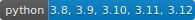

# Template for a Python Project


[](https://github.com/psf/black)


[](https://pycqa.github.io/isort/)

This is an approach towards a beginner-friendly template of a GitHub repository for a Python project with CI/CD-workmode.

It introduces standard tools for checking code style and testing.
Basic usage notes make this self-contained for beginners and provide a quick reference for later.
Furthermore, an exemplary GitHub Actions workflow is contained to run the checks automatically on code submission.

Everything contained here can be seen as knowledge share.
Choose for yourself, which parts you would like to use in your project and simply remove the ones you don't need.

Happy coding!

## Table of Contents
1. [Environment Setup](#environment-setup)
2. [Coding Style](#coding-style)
3. [Testing](#testing)
4. [GitHub Actions and Workflows](#github-actions-and-workflows)
5. [Pre-Commit](#pre-commit)
6. [Readme Badges](#readme-badges)
7. [Repo Structure and Files in Detail](#repo-structure-and-files-in-detail)

## Environment Setup

Install the packages that are necessary for this template with the following command:

```sh
$ pip install -r requirements.txt
```

After adding additional packages to your environment based on your specific project you should update the requirements file.
This can be done by running the following command:

```sh
$ pip freeze > requirements.txt
```

Short explanation:
The first part, `pip freeze`, simply lists all currently installed packages, while `> requirements.txt` is a shell command telling to write that output to the file `requirements.txt`.

## Coding Style

As a best practice, a variety of Python utility packages should be used to check code style conformity (think of "PEP8").
The tools and the commands to invoke them locally are below.
In addition, respective GitHub actions are defined within this repo to check the conformity of any code updates to the repository.

### Flake8

To enforce a standard code style we use the package *flake8*.
To check the code conformity use

```sh
$ flake8 .
```

in the central project folder.
It will print style violations and their locations to the console.

### Black and isort
Additionally, *black* and *isort* are used for code and import formatting, respectively.
They are invoked similarly with the respective commands

```sh
$ black .
```

and

```sh
$ isort .
```

For *black* we also recommend to add the option `--preview` to the end of the command to allow experimental and potentially disruptive style changes, which have improved string processing, e.g. for dealing with very long strings or comments.

### MyPy

*MyPy* describes itself as *"essentially a Python linter on steroids, and it can catch many programming errors by analyzing your program, without actually having to run it"*.
In our case, we use it mainly to check type annotations added to our code.
Invoke the tool via

```sh
$ mypy .
```

## Testing

For testing we use and recommend the package *pytest*.
However, the standard *unittest* package or any alternative will also do - just adjust the testing pipeline accordingly, as the GitHub actions will automatically run the tests with *pytest*.

In order to run the test suite, use the command

```sh
$ pytest
```

### Executing Specific Tests

If the test suite grows bigger and bigger, it might take significant time to run all the tests.
There are options to run only specific tests, either via keyword (case-insensitive string expression) or by using explicit file, class or function names.
For example:

```sh
# Select test file
$ pytest -k "example_test.py"  # Keyword w/ file name
$ pytest tests/example_test.py  # File name

# Select test class
$ pytest -k "TestHelloWorld"  # Keyword w/ class name
$ pytest tests/example_test.py::TestHelloWorld  # File and class name

# Select test function
$ pytest -k "test_return"  # Keyword w/ function name
$ pytest tests/example_test.py::test_return  # File and function name

# Select test function more specifically
pytest tests/example_test.py::TestHelloWorld::test_return  # File, class and function name
```

### Coverage

In order to measure code coverage with tests, we use *coverage*.
Basically, it runs our test suite and checks which parts of our code have been executed and which not.
This also explains why the running command involves our test suite run command:

```sh
$ coverage run --source=project_code -m pytest
```

Note that we use the option `--source=<project_code>` to specify the folder containing the source code.
This is necessary to exclude the test files from the coverage summary as they mess up the overall coverage result.
Additionally, it also finds files that weren't executed at all!
Otherwise they are skipped and might give a wrong impression of the actual coverage.

See the results via

```sh
$ coverage report
```

or `coverage html` to get a more pretty HTML version (which has to be opened outside of the command line).

## GitHub Actions and Workflows

The GitHub documentation states that *"GitHub Actions is a continuous integration and continuous delivery (CI/CD) platform that allows you to automate your build, test, and deployment pipeline.
You can create workflows that build and test every pull request to your repository, or deploy merged pull requests to production."*

In our project we want to use these tools to automate the code checking.
Therefore, a GitHub workflow exists under `.github/workflows/code_quality` that gets triggered upon committing any changes to python files within the repository.
It will then initiate a virtual machine and run our code checks, which include:
* `flake8`
* `black`
* `mypy`
* `isort`
* `pytest`

An error in one of these tools will then show under the Action section in the repository or as part of a pull request.
Passing all the tests should then be a requirement, in order to merge the new code.
In general, direct commits to the main branch should be avoided and instead a pull-request-orientated workmode with reviews should be used.

Note that GitHub Actions consumes computing power - by default on GitHub servers - and thus, induces costs.
Private users have 2.000 Actions minutes per month free.
For business subscriptions this might look different.

## Pre-Commit

With the package *pre-commit* we can perform the code style checks automatically with every commit.
The idea is to identify issues in the code before submitting it.
Therefore, if the checks - or (git) hooks as they are called - do not pass, then the commit is rejected.

In order to use pre-commit we set up the git hook scripts with

```sh
$ pre-commit install
```

Afterwards it will be automatically invoked upon every `git commit` command.

The following command runs it manually, e.g. to not type the code checks individually:

```sh
$ pre-commit run
```

For efficiency, pre-commit only runs on changed files after `git commit`.
However, when adding new hooks it is a good idea to run them against all of the files.
This happens with

```sh
$ pre-commit run --all-files
```

To automatically update the pinned hook versions in the pre-commit config file, we can run

```sh
$ pre-commit autoupdate
```

Note that pre-commit runs the hooks in its own environment, which can be troublesome, if the hook configuration is not identical to the configuration of the individual tools used for checking the code style.

## Readme Badges

This section provides the information to maintain the badges on top of this readme.
While the badges for *black* and *isort* are static, the ones for Python, *coverage* and *flake8* are dynamic and need to be updated, if they should reflect the latest status.

For the Python version we use Google's open source *pybadges*.
For the last two badges we use the library *genbadge*.

### Python Version Badge

According to the [pybadge docu|https://github.com/google/pybadges] the following command generates the badge for the desired Python versions:

```sh
python -m pybadges \
    --left-text="python" \
    --right-text="3.8, 3.9, 3.10, 3.11, 3.12" \
    --whole-link="https://www.python.org/" \
    --embed-logo="https://dev.w3.org/SVG/tools/svgweb/samples/svg-files/python.svg"
```

This will print the SVG XML to the console and you will have to store it under badges as `python_badge.svg`.
To write it to the file append something like `> badges/python_badge.svg`, based on your current working directory.

Note that the library can be used to create any custom badge.

### Coverage Badge

In order to generate and update the coverage badge, run the following sequence of commands after the coverage run:

```sh
# Create XML summary file, which will be used to generate the badge
$ coverage xml

# Generate the badge by providing input and output paths
$ genbadge coverage -i badges/coverage.xml -o badges/coverage_badge.svg
```

### Flake8 Badge

The following command generates the necessary *flake8* statistics for the badge:

```sh
# Generate flake8 summary
$ flake8 . --exit-zero --statistics --tee --output-file badges/flake8stats.txt

# Generate the badge by providing input and output paths
$ genbadge flake8 -i badges/flake8stats.txt -o badges/flake8_badge.svg
```

Short explanation for the flake8 command to generate the summary.
We use
* `flake8 .` to include the whole current directory, in particular including the tests
* `--exit-zero` so that the command always returns with exit code 0 even if problems are found
* `--statistics` to generate a summary necessary for the badge
* `--tee` to write to stdout in addition to generating an output file
* `--output-file` to provide the file name for the output

## Repo Structure and Files in Detail

Sometimes the amount of files or folders in a working directory and their purpose might be confusing, in particular as there are several files or folders that are not relevant for the version control system.

Here is an overview of the relevant files and folders on the most outer layer of this repository:

- [.github/](#github-folder)
- [badges/](#badges-folder)
- [project_code/](#project-code-folder)
- [tests/](#tests-folder)
- [coveragerc](#coverage-config-file)
- [.flake8](#flake8-config-file)
- [.gitignore](#gitignore-config-file)
- [.pre-commit-config.yaml](#pre-commit-config-file)
- [.isort.cfg](#isort-config-file)
- [README.md](#readme-file)
- [requirements.txt](#requirements-file)

Their purposes can be found below.

### GitHub Folder

The folder `.github/` contains the github workflows under the path `.github/workflows/`.
See [GitHub Actions and Workflows](#github-actions-and-workflows) for further information.

### Badges Folder

The folder `badges/` exists for tidyness purposes to gather files necessary for generating the badges at the top of this readme.

### Project Code Folder

As the name suggests, `project_code/` is where the actual project code should go.
Feel free to rename the folder, add more folders or files.

### Tests Folder

The `tests/` folder contains the test routines for *pytest*, which is the recommended testing framework besides the standard *unittest* package.

*pytest*
[Docu](https://docs.pytest.org/en/latest/) |
[PyPi Reference](https://pypi.org/project/pytest/)

### Coverage Config File

The file `.coveragerc` is the configuration file for *coverage*, which we use to measure our test coverage - how much of our code is covered by tests?

*coverage*
[Docu](https://coverage.readthedocs.io/en/latest/)
[PyPi Reference](https://pypi.org/project/coverage/)


### Flake8 Config File

The file `.flake8` is the configuration file for *flake8*.
It wraps different tools (e.g. [*pycodestyle*](https://pycodestyle.pycqa.org/en/latest/)) that enforce Python style guide ("PEP8").

*flake8*
[Docu](https://flake8.pycqa.org/en/latest/) |
[PyPi Reference](https://pypi.org/project/flake8/)

### GitIgnore Config File

The `.gitignore` file lists the files and file types to exclude from the git repository.
For example `__pycache__` or environment files should not be added.
By default the list contains a reasonable set, however, feel free to add entries based on your project.

### isort Config File

The `.isort.cfg` file is a configuration file for *isort* - a package to sort Python imports.
The configuration ensures the compatibility with the code formatting package *black*.

*isort*
[Docu](https://pycqa.github.io/isort/) |
[PyPi Reference](https://pypi.org/project/isort/)

### Pre-Commit Config File

The file `.pre-commit-config.yaml` configures the GitHub hooks used by *pre-commit*.
The same code style checks that we use in the GitHub Action should be included as pre-commit hooks.

### Readme File

The `README.md` is the file you are currently reading.
If you are new to this repository it should introduce you to this template.
Once you start working on your project feel free to overwrite its content with instructions that are useful for your project, e.g.
- A brief project description
- How to install this module or how to setup a working environment for running the code
- How to use the module

### Requirements File

The `requirements.txt` contains the list of modules and their versions necessary to run the code.
See [Environment Setup](#environment-setup) in order to install and update the file.
